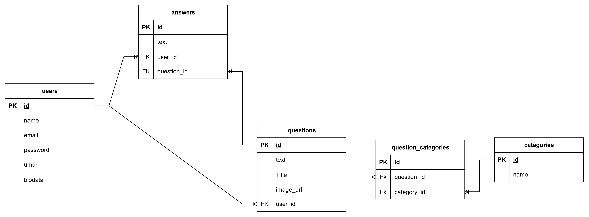

# Forum Tanya Jawab

Aplikasi ini adalah platform forum internal untuk mengelola pertanyaan, jawaban, serta kategori topik. Pengguna yang sudah terdaftar dapat membuat thread baru, menambahkan jawaban, dan memperbarui profil pribadi sambil memanfaatkan antarmuka dashboard.

## Fitur Utama
- **Autentikasi pengguna**: registrasi, login, dan logout aman berbasis sesi Laravel.
- **Dashboard ringkas**: menampilkan daftar pertanyaan terbaru guna memantau aktivitas komunitas.
- **Manajemen pertanyaan**: CRUD penuh dengan dukungan unggah gambar serta tagging multi-kategori.
- **Diskusi jawaban**: setiap pertanyaan dapat menerima banyak jawaban yang bisa diperbarui atau dihapus oleh penulisnya.
- **Profil pengguna**: pembaruan biodata, email, sandi, umur, dan alamat langsung dari halaman profil.

## Teknologi & Dependensi
- **Backend**: Laravel 12 (PHP 8.2) dengan Eloquent ORM dan validasi Form Request.
- **Frontend**: Blade + Vite build pipeline, integrasi AdminLTE/TinyMCE dari direktori `public/`.
- **Database**: SQLite bawaan (`database/database.sqlite`) atau koneksi lain via `.env`.
- **Pendukung**: TinyMCE untuk editor WYSIWYG, Laravel Debugbar (dev), PHPUnit untuk pengujian.

## Struktur Inti
- `app/Http/Controllers` – logika autentikasi, pertanyaan, jawaban, kategori, dan profil.
- `app/Models` – relasi Eloquent (`Question`, `Answer`, `Category`, `User`) dengan pivot `question_categories`.
- `resources/views` – halaman Blade untuk auth, dashboard, profil, kategori, dan pertanyaan.
- `database/migrations` – skema tabel users, categories, questions, answers, serta tabel pivot.

## ERD


## Alur Pengguna
1. Pengunjung membuat akun atau login.
2. Setelah berhasil, diarahkan ke `dashboard` yang menampilkan ringkasan pertanyaan terbaru.
3. Pengguna dapat:
   - Membuat pertanyaan baru, memilih kategori, dan menyertakan gambar.
   - Menjawab pertanyaan dan mengelola jawaban sendiri.
   - Mengelola kategori.
   - Memperbarui profil pribadi.

## Menjalankan Aplikasi Secara Lokal
```bash
composer install
cp .env.example .env   # atau gunakan perintah copy yang sesuai di Windows
php artisan key:generate
# atur konfigurasi DB di .env (default SQLite sudah tersedia)
php artisan migrate --seed
npm install
npm run build          # atau npm run dev untuk pengembangan
php artisan serve
```

Setelah `php artisan serve`, kunjungi `http://localhost:8000`.

## Pengujian
Gunakan perintah berikut untuk memastikan fungsionalitas tetap stabil:
```bash
php artisan test
```

## Demo Video
[Tonton demo aplikasi](https://drive.google.com/file/d/1RwU-I0KOg8CGsx3tOeBJqCKnGNJlp8M5/view?usp=sharing)

## Link Deployment
[Akses aplikasi yang ter-deploy](https://forum-tanya-jawab-production.up.railway.app/login)